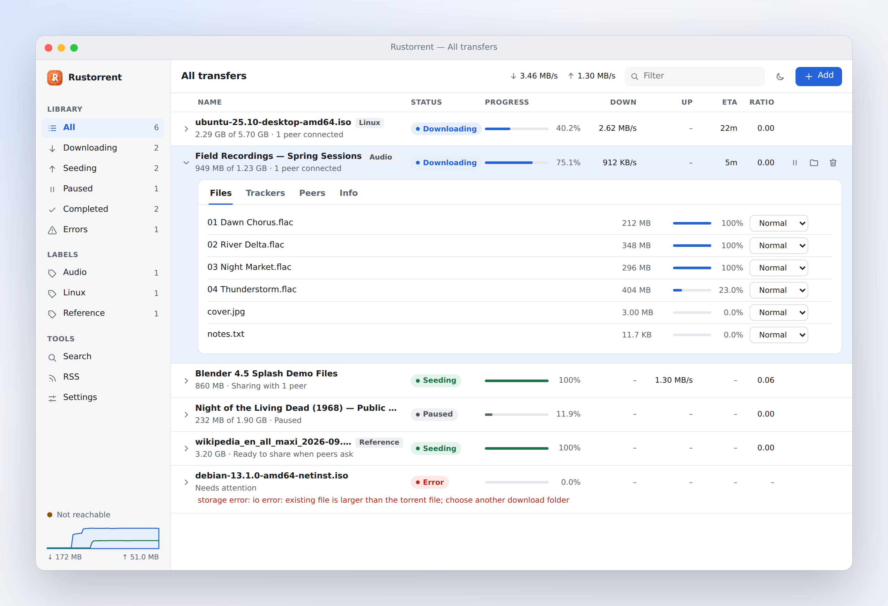
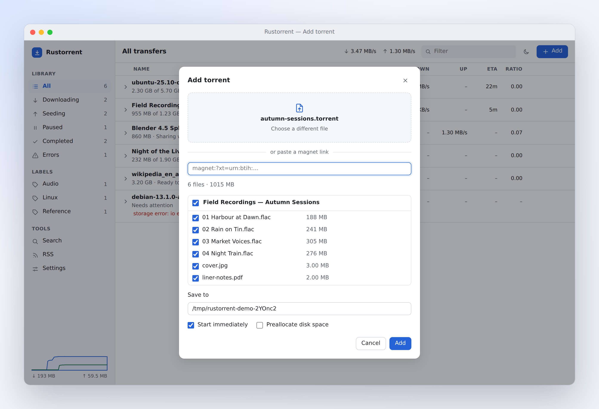
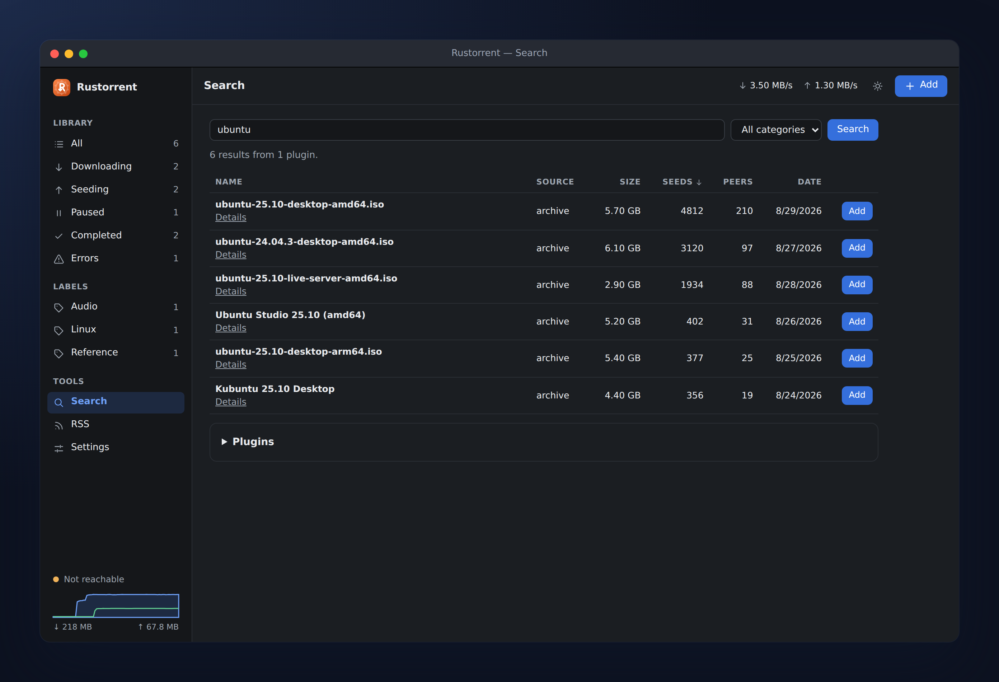
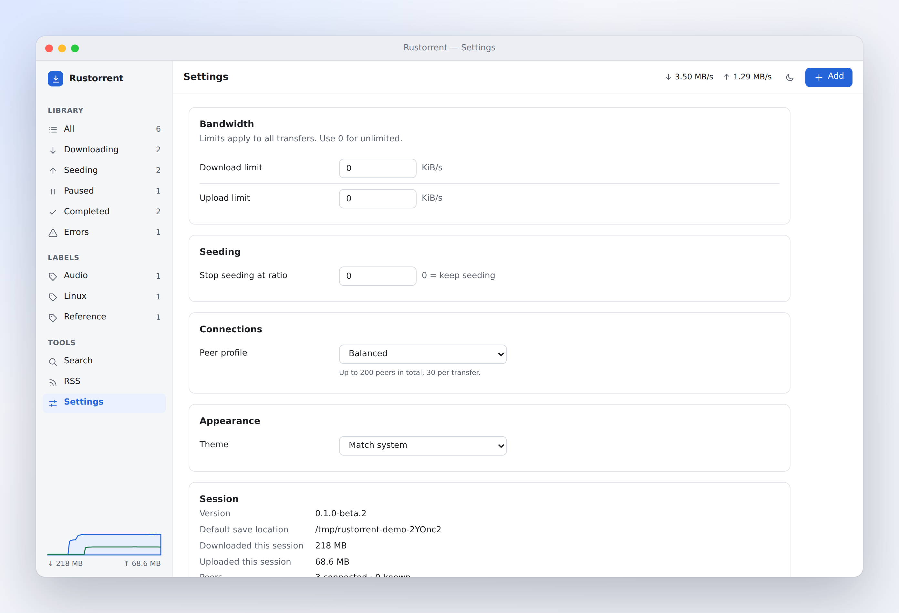
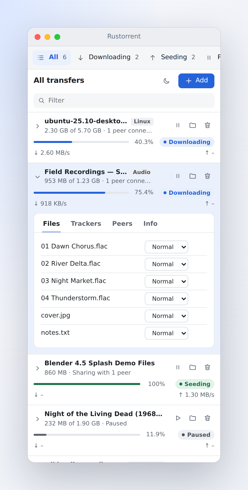
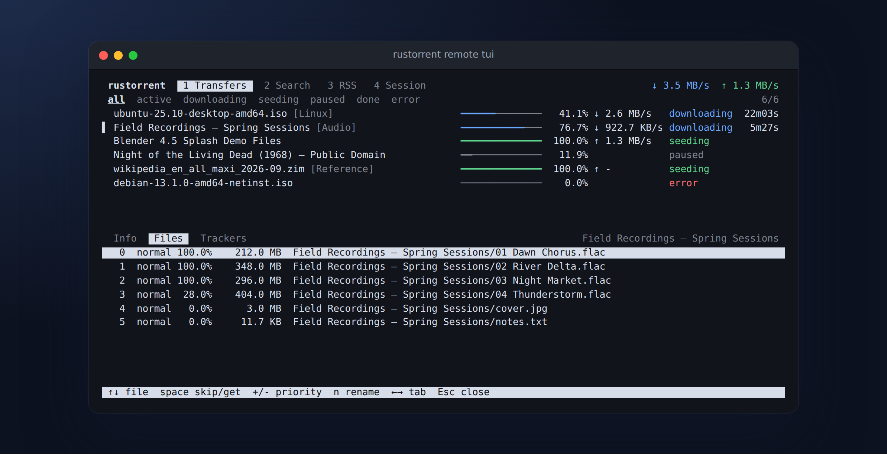
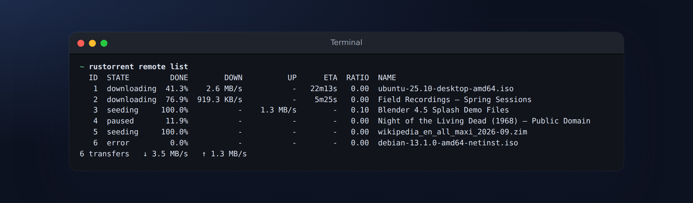

<div align="center">


# Rustorrent

**A fast, private BitTorrent client in a download under 1 MB.**<br>
Web, terminal and command-line interfaces, and no runtime dependencies.

[](https://github.com/josusanmartin/rustorrent/actions/workflows/ci.yml)
[](LICENSE)
[](https://www.rust-lang.org)


[Features](#features) · [Quick start](#quick-start) · [Interfaces](#three-ways-to-drive-it) · [Recipes](#recipes) · [Options](#all-options) · [Build](#building-from-source) · [Development](#development)

<br>

<picture>
  <source media="(prefers-color-scheme: dark)" srcset="docs/screenshots/hero-dark.png">
  
</picture>

</div>

## Why Rustorrent

<table>
<tr>
<td width="33%" valign="top">

### 🪶 Tiny and self-contained
The whole app downloads in under 1 MB (789 KB for Apple silicon, 816 KB for Linux) as one
executable, with no installer, runtime or database.
Bencode, SHA-1/SHA-256, HTTP, DHT, uTP, encryption and the web interface are all written in this
repository.

</td>
<td width="33%" valign="top">

### ⚡ Fast where it counts
Hardware-accelerated hashing at about 1.5 GB/s, a 64 KiB-batched peer loop, and a piece
picker that works on whole bitfield words. Background announces and resume saves never stall
peers.

</td>
<td width="33%" valign="top">

### 🔒 Private by design
The web interface only listens on loopback and uses per-session tokens, strict host and origin
checks and a tight content security policy. Proxy mode fails closed, peer encryption is on by
default, and existing files are protected on disk.

</td>
</tr>
</table>

## Features

<table>
<tr>
<td valign="top">

**Protocol**
- BitTorrent v1, v2 and hybrid torrents, verified with SHA-1 and SHA-256
- Magnet links, with metadata from peers and DHT
- HTTP, HTTPS and UDP trackers (BEP 15)
- DHT (BEP 5) with iterative lookups
- Peer exchange (PEX) and local peer discovery (BEP 14)
- uTP (BEP 29) with LEDBAT congestion control
- Fast extension (BEP 6) and web seeds (BEP 19)
- Message stream encryption: prefer or require
- Super-seeding (BEP 16)

</td>
<td valign="top">

**Everyday use**
- Choose files and set priorities before starting
- Labels, filters and search in every interface
- Sequential download for streaming
- Global and per-torrent rate limits, named throttle groups and schedules
- Seed-ratio and seed-time goals, with ratio groups
- Watch folder, move-on-complete and completion scripts
- RSS/Atom feeds with automatic download rules
- qBittorrent-compatible search plugins
- Create `.torrent` files

</td>
<td valign="top">

**Networking and safety**
- NAT-PMP and UPnP port mapping, refreshed automatically
- SOCKS5 and HTTP proxy with fail-closed isolation
- PeerGuardian, eMule DAT and plain IP blocklists
- Optional GeoIP peer countries
- Crash-safe resume state with atomic writes
- Descriptor-relative, symlink-safe file access
- Fuzzed parsers for untrusted input
- Session restored on restart

</td>
</tr>
</table>

## Quick start

```sh
# Build (Rust 1.89+; Linux also needs pkg-config and the OpenSSL headers)
cargo build --release

# Download a torrent or a magnet link from the console
./target/release/rustorrent ubuntu.torrent
./target/release/rustorrent "magnet:?xt=urn:btih:…"

# Or start the library with the web interface
./target/release/rustorrent --ui --download-dir ~/Downloads
open http://127.0.0.1:8080
```

## Three ways to drive it

The browser, the terminal interface and `rustorrent remote` all use the same local API, so each
offers the same actions: add, pause, resume, verify, remove (with or without files), file
priorities and renames, labels, trackers, rate limits, seed ratio, peer profile, search and RSS.

### 1 · The web interface

```sh
rustorrent --ui                  # http://127.0.0.1:8080
rustorrent --ui 9090             # custom port
rustorrent --daemon              # background service with the web interface (Unix)
```

It is a calm, keyboard-friendly workspace. Filter by state or label from the sidebar, expand a
transfer to change file priorities, trackers, peers and details in place, and drop a `.torrent`
anywhere or paste a magnet to add it. Live updates stream only what changed, so typing, focus and
scroll position are never interrupted. The theme follows the system in light and dark.

<table>
<tr>
<td width="50%" valign="top"><br><sub><b>Add</b>: preview a torrent and pick files before it starts.</sub></td>
<td width="50%" valign="top"><br><sub><b>Search</b>: qBittorrent-compatible plugins, one-click add.</sub></td>
</tr>
<tr>
<td width="50%" valign="top"><br><sub><b>Settings</b>: limits, ratio goals, peer profile and theme.</sub></td>
<td width="50%" align="center"><br><sub><b>Narrow screens</b>: the layout adapts down to phone width.</sub></td>
</tr>
</table>

<sub>Shortcuts: <kbd>/</kbd> filter · <kbd>A</kbd> add · <kbd>↑</kbd><kbd>↓</kbd> move · <kbd>Enter</kbd> details · <kbd>Space</kbd> pause or resume · <kbd>Delete</kbd> remove · <kbd>Esc</kbd> close</sub>

> [!NOTE]
> The server only binds to loopback addresses. For access from another machine, use an SSH
> tunnel or an authenticated HTTPS reverse proxy rather than exposing it to the network.

### 2 · The terminal interface

```sh
rustorrent --tui --download-dir ~/Downloads     # run with a full-screen interface
rustorrent remote tui                           # or attach to a running daemon
```



| Key | Action | Key | Action |
|---|---|---|---|
| <kbd>1</kbd>–<kbd>4</kbd> | Transfers · Search · RSS · Session | <kbd>Enter</kbd> | Details: Info, Files, Trackers (<kbd>←</kbd><kbd>→</kbd>) |
| <kbd>a</kbd> | Add a `.torrent` path or magnet | <kbd>Space</kbd> | Pause or resume, or skip/get a file |
| <kbd>s</kbd> <kbd>v</kbd> <kbd>A</kbd> | Stop, verify, archive | <kbd>+</kbd> <kbd>-</kbd> <kbd>n</kbd> | File priority, rename |
| <kbd>d</kbd> | Remove; keep or delete the files | <kbd>Tab</kbd> <kbd>/</kbd> | Cycle state filter, find by name |
| <kbd>b</kbd> | Set a label | <kbd>L</kbd> | Global rate limits, e.g. `5m 1m` |
| <kbd>?</kbd> | All keys | <kbd>q</kbd> | Quit |

### 3 · Scripting with `rustorrent remote`



```sh
rustorrent remote add ubuntu.torrent --paused --skip 2,3   # choose files up front
rustorrent remote add "magnet:?xt=urn:btih:…" --dir ~/Videos
rustorrent remote info 1                                   # details, files and trackers
rustorrent remote resume all
rustorrent remote priority 1 0 4 high                      # files 0 and 4
rustorrent remote label 1 linux-isos
rustorrent remote remove 1 --delete-files
rustorrent remote limit 5m 1m                              # global down/up
rustorrent remote search ubuntu desktop && rustorrent remote get 3
rustorrent remote rss add-feed https://example.org/feed.xml
rustorrent remote list --json | jq '.[] | select(.paused)'
```

Transfers can be named by id or by an info-hash prefix. `list`, `info`, `session` and `search`
accept `--json`. Use `--ui-addr` or `RUSTORRENT_UI_ADDR` for a non-default address, and
`rustorrent remote help` for every command.

### Plain console

Run it with just a torrent and it prints one progress line until you press <kbd>Ctrl</kbd>+<kbd>C</kbd>:

```text
$ rustorrent --download-dir ~/Downloads ubuntu-25.10-desktop-amd64.iso.torrent
[#######-----------------------]  23.40% 1.33 GB/5.70 GB 4.21 MB/s ETA 17:44 peers 12/30 downloading
```

## Recipes

<details>
<summary><b>Bandwidth: global and per-torrent limits, throttle groups and schedules</b></summary>

```sh
# Limit to 5 MiB/s down and 1 MiB/s up (k/m/g suffixes, 0 = unlimited)
rustorrent --download-rate 5m --upload-rate 1m ubuntu.torrent

# Limit each torrent individually
rustorrent --torrent-download-rate 2m file.torrent

# Throttle downloads to 256 KiB/s every hour
rustorrent --ui --schedule 3600:throttle_down:262144
```

Scheduler commands are `pause_all`, `resume_all`, `stop_ratio_reached`, `throttle_down:<bps>`
and `throttle_up:<bps>`.
</details>

<details>
<summary><b>Encryption, proxies and blocklists</b></summary>

```sh
rustorrent --encryption require ubuntu.torrent      # refuse unencrypted peers
rustorrent --no-encryption ubuntu.torrent           # plaintext only
rustorrent --proxy socks5://127.0.0.1:9050 --ui     # route peers and trackers through a proxy
rustorrent --blocklist level1.p2p ubuntu.torrent    # PeerGuardian, eMule DAT or start-end lines
```

Proxy mode fails closed. Peer TCP and HTTP(S) trackers go through the proxy. Everything that
cannot is disabled so it never bypasses the proxy: inbound peers, DHT, LPD, uTP, UDP trackers,
port mapping, web seeds, RSS, search downloads and magnet HTTP sources. Use a literal proxy IP if
even the proxy's own DNS lookup must stay on the host.
</details>

<details>
<summary><b>Peers: profiles and limits</b></summary>

```sh
rustorrent --peer-profile conservative ubuntu.torrent
rustorrent --max-peers 800 --max-peers-torrent 150 ubuntu.torrent
rustorrent --ui --max-active 2        # at most two downloads at once
```

| Profile | Global peers | Per torrent | Tracker `numwant` | Magnet metadata peers |
|---|---|---|---|---|
| `conservative` | 120 | 30 | 50 | 20 |
| `balanced` (default) | 500 | 100 | 200 | 80 |
| `aggressive` | 1000 | 200 | 500 | 160 |

Balanced matches qBittorrent's defaults. Peers that connect to you get their own slots, up to the
same per-torrent limit, so outgoing connections cannot crowd them out. In the web interface,
**Settings › Connections › Connections per transfer** changes the per-torrent limit and remembers
it; choosing a profile there goes back to the profile's value. Explicit `--max-peers`,
`--max-peers-torrent` and `--numwant` flags, or the same keys in a config file, override both.
Seeding and paused torrents do not count toward `--max-active`.
</details>

<details>
<summary><b>Library automation: watch folders, completion and RSS</b></summary>

```sh
# Add every .torrent dropped into ~/watch (processed files move to processed/)
rustorrent --watch ~/watch --download-dir ~/Downloads

# Download to an incomplete folder, then move finished files
rustorrent --download-dir ~/incomplete --move-completed ~/complete ubuntu.torrent

# Run a script when a torrent finishes; it receives TORRENT_NAME, TORRENT_DIR,
# TORRENT_HASH and TORRENT_SIZE and runs at most once per torrent
rustorrent --on-complete ~/bin/notify.sh --ui

# Poll a feed every 15 minutes and add items that match a pattern
rustorrent --rss https://example.org/feed.xml --rss-rule 'https://example.org/feed.xml:*ubuntu*'

# Stop seeding at ratio 2.0 or after 12 hours
rustorrent --seed-ratio 2 --max-seed-time 720 --ui
```
</details>

<details>
<summary><b>Disk: preallocation, write cache and sequential mode</b></summary>

```sh
rustorrent --preallocate ubuntu.torrent        # reserve space up front; never truncates existing data
rustorrent --write-cache 16m ubuntu.torrent    # batch writes for slow disks
rustorrent --sequential movie.torrent          # download in order for streaming
```
</details>

<details>
<summary><b>Creating torrents</b></summary>

```sh
rustorrent --create ./my-project \
  --tracker http://tracker.example.com:6969/announce \
  --output my-project.torrent \
  --piece-length 262144
```
</details>

<details>
<summary><b>Configuration files and environment</b></summary>

```ini
# rustorrent.conf
peer_profile = conservative
download_rate = 5m
upload_rate = 1m
```

```sh
rustorrent --config rustorrent.conf --ui
export RUSTORRENT_CONFIG=~/.config/rustorrent.conf
export RUSTORRENT_PEER_PROFILE=conservative
```

Command-line flags override environment variables, which override the config file. Unknown keys
are rejected, so a typo never silently changes behaviour.
</details>

<details>
<summary><b>Magnet and v2 details</b></summary>

For v1 magnets, metadata is fetched from explicit peers, trackers and DHT. A v2-only or hybrid
magnet currently needs a verified `xs`/`as` HTTP source containing the complete `.torrent`,
including its piece layers. For hybrid torrents, peer handshakes support the BEP 52 v2 upgrade,
but trackers, DHT and LPD announce the v1 swarm identifier.
</details>

## All options

<details>
<summary><b>Every flag</b> (also <code>rustorrent --help</code>)</summary>

| Flag | Default | Description |
|---|---|---|
| `[file.torrent \| magnet]` | | A torrent file or magnet link to add at startup |
| `--magnet <link>` | | Add a magnet link |
| `--download-dir <dir>` | `.` | Download directory |
| `--ui [port]` | off | Web interface on loopback (default port 8080) |
| `--ui-addr <addr>` | `127.0.0.1:8080` | Web interface address (loopback only) |
| `--tui` | off | Interactive terminal interface |
| `--daemon` | off | Run in the background with the web interface (Unix) |
| `--pid-file <path>` | | Write the process id after startup locking |
| `--log <path>` | | Append logs to a file |
| `--port <port>` | picked on first run | Incoming peer port. A random port is chosen once and kept with the session. |
| `--no-port-mapping` | | Do not request NAT-PMP/UPnP mappings |
| `--encryption <mode>` | `prefer` | `disable`, `prefer` or `require` |
| `--no-encryption` | | Shorthand for `--encryption disable` |
| `--utp` / `--no-utp` | on | Micro transport protocol |
| `--peer-profile <name>` | `balanced` | `conservative`, `balanced` or `aggressive` |
| `--max-peers <n>` | `500` | Global peer limit |
| `--max-peers-torrent <n>` | `100` | Per-torrent peer limit |
| `--max-active <n>` | `4` | Concurrently loading or downloading transfers |
| `--numwant <n>` | `200` | Peers requested from trackers |
| `--retry-interval <secs>` | `300` | Least time between early tracker announces (a tracker's `min interval` can make it longer) |
| `--download-rate <rate>` | `0` | Global download limit (`k`/`m`/`g`) |
| `--upload-rate <rate>` | `0` | Global upload limit |
| `--torrent-download-rate <rate>` | `0` | Per-torrent download limit |
| `--torrent-upload-rate <rate>` | `0` | Per-torrent upload limit |
| `--throttle <name:down_kbps:up_kbps>` | | Named throttle group |
| `--schedule <secs:command>` | | Run a scheduler command periodically |
| `--sequential` | off | Download pieces in order |
| `--preallocate` | off | Reserve disk space up front |
| `--write-cache <size>` | `0` | Write cache size (0 = off) |
| `--move-completed <dir>` | | Move finished downloads here |
| `--watch <dir>` | | Add `.torrent` files dropped into a folder |
| `--on-complete <script>` | | Run a program when a transfer finishes |
| `--seed-ratio <ratio>` | `0` | Stop seeding at this ratio (0 = never) |
| `--max-seed-time <minutes>` | `0` | Stop seeding after this long (0 = never) |
| `--super-seed` | off | Super-seed completed transfers |
| `--ratio-group <name:ratio:action>` | | Ratio group (`stop`, `pause` or `none`) |
| `--proxy <url>` | | `socks5://` or `http://` proxy, fail-closed |
| `--blocklist <path>` | | IP ranges to refuse |
| `--geoip-db <path>` | | CSV IPv4-range/CIDR-to-country database |
| `--rss <url>` | | Poll an RSS/Atom feed (repeatable) |
| `--rss-rule <feed:pattern>` | | Add matching feed items (repeatable) |
| `--rss-interval <secs>` | `900` | Feed polling interval |
| `--create <path>` | | Create a torrent from a file or folder |
| `--tracker <url>` | | Tracker for `--create` |
| `--output <file>` | `<source>.torrent` | Output for `--create` |
| `--piece-length <bytes>` | `262144` | Piece length for `--create` |
| `--config <path>` | | Settings file (also `RUSTORRENT_CONFIG`) |
| `-h`, `--help` / `-V`, `--version` | | Help and version |

</details>

## Performance

Measured on a shared 4-vCPU Linux VM against local peers. Real-world swarms are limited by the
network.

| | Throughput |
|---|---|
| SHA-1 piece hashing | **1.5 GB/s** with SHA-NI · 460 MB/s portable |
| Download, 4 seeders, 1 GiB | **164 MB/s** |
| Upload, 4 leechers | **675 MB/s** |
| uTP over loopback | **100–135 MB/s** |
| Piece selection, 50,000 pieces | **18 µs** per pick |

## Building from source

Rust 1.89 or newer is required. Linux builds also need `pkg-config` and the OpenSSL development
package (`libssl-dev` on Debian/Ubuntu, `openssl-devel` on Fedora).

```sh
cargo build --release                                  # everything
cargo build --release --no-default-features            # minimal: TCP, HTTP trackers, no DHT/uTP/MSE
cargo build --release --no-default-features --features dht,utp,mse   # pick and choose
```

Optional features: `udp_tracker`, `dht`, `lpd`, `utp`, `mse`, `natpmp`, `upnp`, `webseed`
(all in the default `full` set) and `verbose` for protocol logging.

The release profile optimises for size: `opt-level = "z"`, LTO, one codegen unit, abort on panic
and stripped symbols, with integer-overflow checks kept on. `build.rs` gzips the web interface
and the search runtime at build time. The result is a 1.6 MB executable that compresses to under
1 MB: Beta 2 ships as a 789 KB Apple silicon DMG and an 816 KB Linux archive.

**macOS app:** `./macos/package_app.sh --universal --dmg` builds an ad-hoc signed universal
`Rustorrent.app` with a native window and a disk image.

### Dependencies

Only three crates are used directly: `native-tls` for HTTPS trackers, `libc` for safe Unix file
flags and terminal control, and `getrandom` for operating-system entropy. Everything else is
implemented in this repository.

### Platform support

| Platform | Status |
|---|---|
| macOS 11+ (Intel and Apple silicon) | ✅ Supported, with a native app bundle |
| Linux x86_64 | ✅ Supported and tested in CI |
| Linux aarch64 | 🟡 Builds from source; not runtime-tested in CI |
| Windows 10/11 | ✅ [Native desktop window](windows/README.md), CLI, web and terminal interfaces. Desktop requires WebView2; `--daemon` remains Unix-only |

## Development

```sh
cargo test --locked --all-features -- --test-threads=1   # unit, process and transport tests
cargo build --locked
python3 tests/e2e_transfer.py                            # real-process transfers and crash recovery
python3 tests/e2e_transmission.py                        # interoperability (needs transmission-daemon)
npm ci && npx playwright install chromium
npm run test:e2e                                         # browser flows and WCAG A/AA checks
```

The screenshots in this README come from a real release build driving a demo library:

```sh
cargo build --release && RUSTORRENT_SCREENSHOTS=1 npx playwright test screenshots
```

Node and Playwright are development tools only; the application embeds its own HTML, CSS,
JavaScript and icons. More background: [design notes](DESIGN.md) ·
[audit report](docs/AUDIT_REPORT_2026-09-26.md) · [beta readiness](docs/BETA_READINESS.md).

> [!WARNING]
> Rustorrent is prerelease software. Search plugins are third-party Python programs that run with
> your privileges; review a plugin before installing it.

## License

Rustorrent is licensed under [MIT](LICENSE). The bundled qBittorrent-compatible search runtime
keeps its BSD-3-Clause terms; see [Third-Party Notices](THIRD_PARTY_NOTICES.md). Exact dependency
versions and license texts are in [Third-Party Licenses](THIRD_PARTY_LICENSES.html), which CI
regenerates from `Cargo.lock`.

<div align="center"><sub>Built with Rust.</sub></div>
